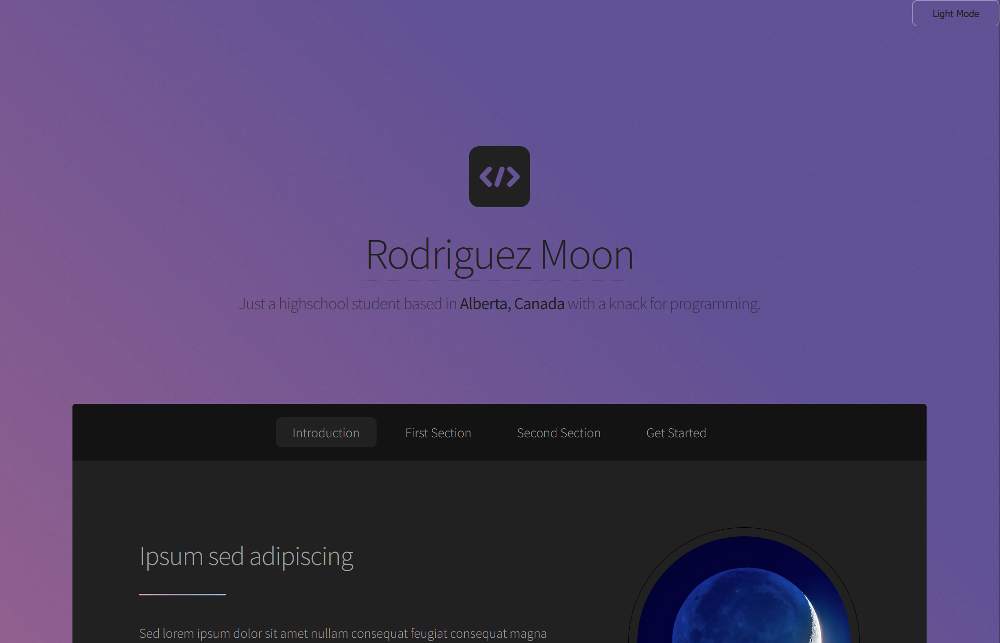

<h1 align="center">
    My Portfolio ✨
</h1>

<h3 align="center">
    Check it out
    <a href="https://rodriguez-moon.github.io">
        here
    </a>
</h3>

### To Do
- [ ] Implement dark mode 🦉
- [ ] Replace filler 'lorem ipsum' text 📄
- [ ] Replace filler images 📷
